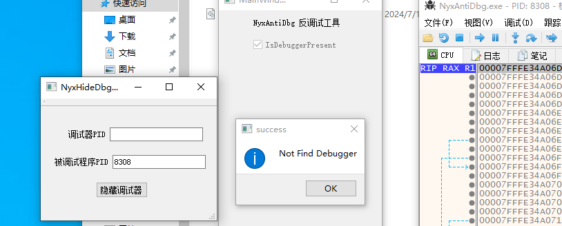
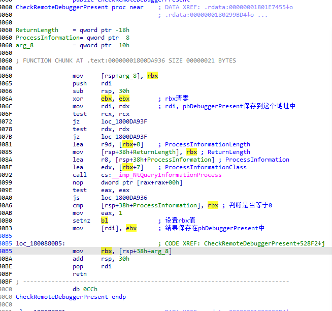
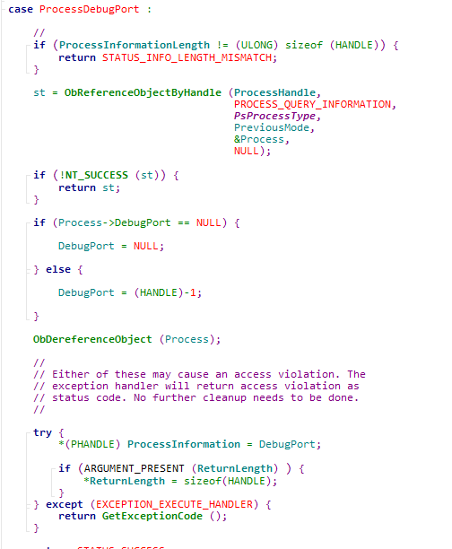
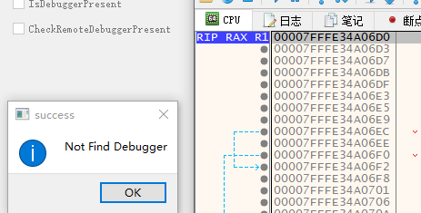

# 反调试与反反调试专题

## 01 - IsDebuggerPresent

`IsDebuggerPresent()`函数用来检测当前进程是否被调试，可以被认为是最最基础的调试器检测手段。

其函数实现在 `kernelbase.dll`，其简单两行来实现。

```
.text:000000018000E7F0 IsDebuggerPresent proc near         
.text:000000018000E7F0                                         ; DATA XREF: .rdata:00000001801E636B↓o ...
.text:000000018000E7F0                 mov     rax, gs:60h
.text:000000018000E7F9                 movzx   eax, byte ptr [rax+2]
.text:000000018000E7FD                 retn
.text:000000018000E7FD IsDebuggerPresent endp
```

gs在三环指向TEB，TEB+0x60指向PEB；PEB + 0x2指向一个`BeingDebugged`。

```
struct _PEB
{
    UCHAR InheritedAddressSpace;                                            //0x0
    UCHAR ReadImageFileExecOptions;                                         //0x1
    UCHAR BeingDebugged;                                                    //0x2
    ····
}
```

### IsDebuggerPresent反制手段 

既然清楚其原理是通过判断PEB的DeingDebugged位，我们通过驱动编写，将这个位置清零即可。

Windows内核中有一个导出但未声明的函数 `PsGetProcessPeb` ，通过该函数获取PEB即可。

```c++
EXTERN_C PPEB PsGetProcessPeb(PEPROCESS Process);
```

修改时切记要附加到该进程，否则会出现内存读写页错误。



## 02 - CheckRemoteDebuggerPresent

该函数也是一个常用来检测调试器的手段，与`IsDebuggerPresent`不同，该函数还可以用来检测其他进程是否存在调试器，传入一个进程句柄即可。

```c++
WINBASEAPI
BOOL
WINAPI
CheckRemoteDebuggerPresent(
    _In_ HANDLE hProcess,
    _Out_ PBOOL pbDebuggerPresent
    );
```

其函数实现在`kernelbase.dll`中，查看该函数，本质调用`NtQueryInformationProcess`



查看wrk，其代码如下，本质来说就是查看这个进程的DebugPort，如果没有则返回0，如果有则返回0xFFFFFFFF



知道其检测思路了，现在有两种解决方法：
1. Hook NtQueryInformationProcess函数；
2. DebugPort移位操作，直接清空。

我们现在学习，基于一对一的，因此采取第一种方法，其代码如下。

```c++
NTSTATUS  fake_NtQueryInformationProcess(
    __in HANDLE ProcessHandle,
    __in PROCESSINFOCLASS ProcessInformationClass,
    __out_bcount(ProcessInformationLength) PVOID ProcessInformation,
    __in ULONG ProcessInformationLength,
    __out_opt PULONG ReturnLength
    ) {

    if (ProcessDebugPort != ProcessInformationClass) {
        return org_NtQueryInformationProcess(ProcessHandle, ProcessInformationClass, ProcessInformation, ProcessInformationLength, ReturnLength);
    }

    PEPROCESS process;
    KPROCESSOR_MODE PreviousMode;
    NTSTATUS status;

    status = ObReferenceObjectByHandle(
        ProcessHandle,
        // #define PROCESS_QUERY_INFORMATION          (0x0400)  
        0x0400, //  PROCESS_QUERY_INFORMATION
        *PsProcessType,
        KernelMode,
        (PVOID*)&process,
        NULL
    );

    if (!NT_SUCCESS(status)) {
        return status;
    }

    if (NT_SUCCESS(status)) {
        HANDLE pid = PsGetProcessId(process); 
        if (pid == g_DebuggedProcessId) {
            DbgPrintEx(77, 0, "[db]:fake_NtQueryInformationProcess\r\n");
            *(PHANDLE)ProcessInformation = 0;
            return STATUS_SUCCESS;
        }
    }

    ObDereferenceObject(process);
    
    return org_NtQueryInformationProcess(ProcessHandle, ProcessInformationClass, ProcessInformation, ProcessInformationLength, ReturnLength);
}
```

通过这种方法，当发现其检测被调试进程时，直接结果返回0，表示没有检测到DebugPort。

反反调试成功！

