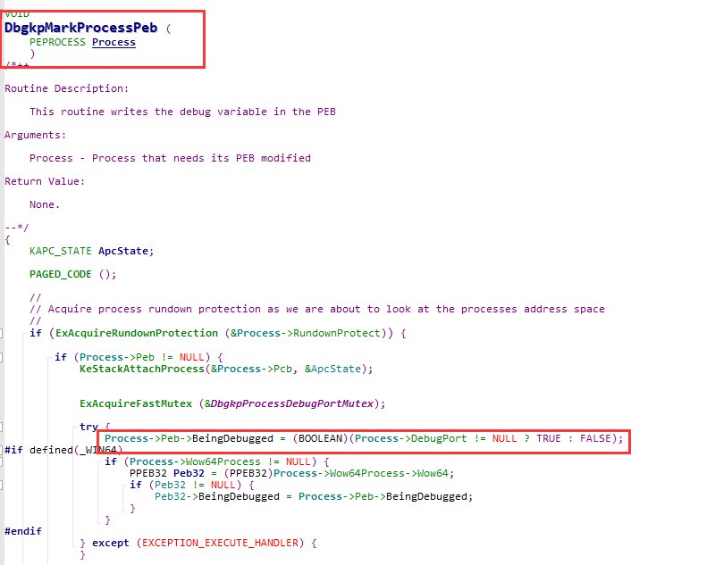
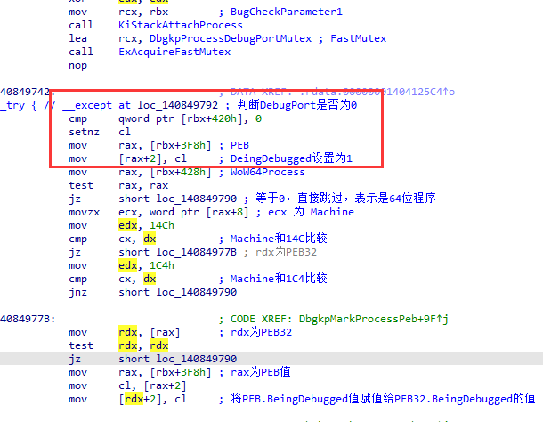
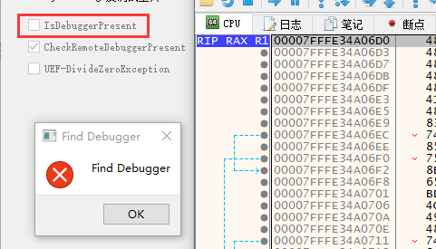
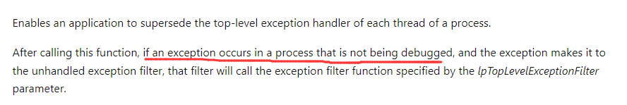
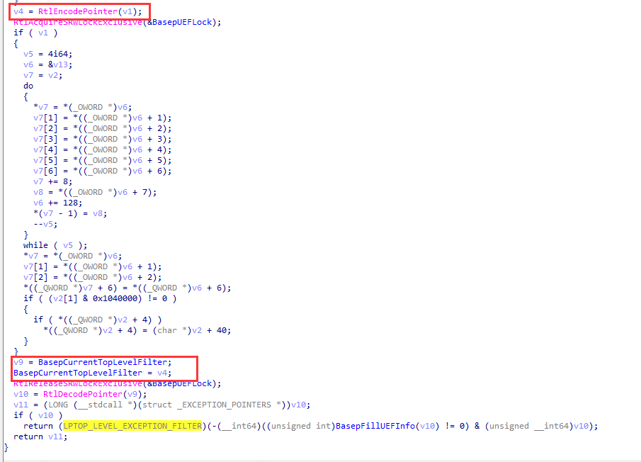
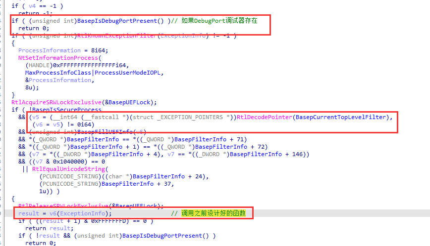
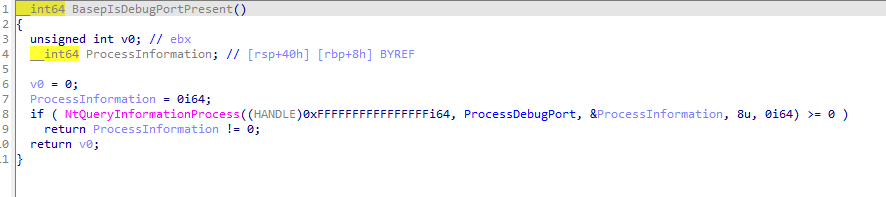
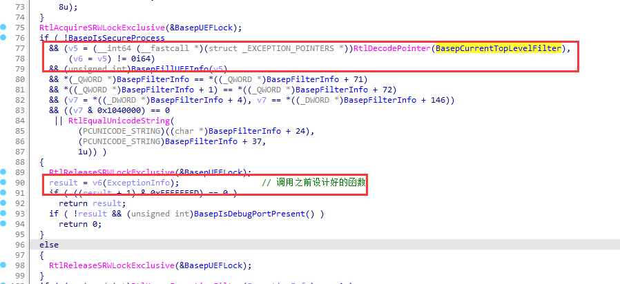
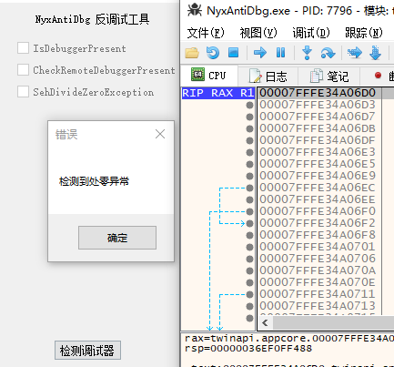

# 反调试与反反调试专题

## 01 - IsDebuggerPresent

`IsDebuggerPresent()`函数用来检测当前进程是否被调试，可以被认为是最最基础的调试器检测手段。

其函数实现在 `kernelbase.dll`，其简单两行来实现。

```
.text:000000018000E7F0 IsDebuggerPresent proc near         
.text:000000018000E7F0                                         ; DATA XREF: .rdata:00000001801E636B↓o ...
.text:000000018000E7F0                 mov     rax, gs:60h
.text:000000018000E7F9                 movzx   eax, byte ptr [rax+2]
.text:000000018000E7FD                 retn
.text:000000018000E7FD IsDebuggerPresent endp
```

gs在三环指向TEB，TEB+0x60指向PEB；PEB + 0x2指向一个`BeingDebugged`。

```
struct _PEB
{
    UCHAR InheritedAddressSpace;                                            //0x0
    UCHAR ReadImageFileExecOptions;                                         //0x1
    UCHAR BeingDebugged;                                                    //0x2
    ····
}
```

### IsDebuggerPresent反制手段 

既然清楚其原理是通过判断PEB的DeingDebugged位，我们通过驱动编写，将这个位置清零即可。

Windows内核中有一个导出但未声明的函数 `PsGetProcessPeb` ，通过该函数获取PEB即可。

```c++
EXTERN_C PPEB PsGetProcessPeb(PEPROCESS Process);
```

修改时切记要附加到该进程，否则会出现内存读写页错误。


### BeingDebugged的修改时机

我们下面开一个小灶，研究一下BeingDebugged何时被修改的。

先通过wrk确定其修改位置，其在`DbgkpMarkProcessPeb`中被修改



其函数逆向如下图所示



`DbgkpMarkProcessPeb`函数被`DbgkpSetProcessDebugObject`函数调用

而`DbgkpSetProcessDebugObject` 被 `NtDebugActiveProcess`函数调用

现在函数的调用思路就清晰了，调试器在设置`DebugObject`的时候，将`PEB.BeingDebugged`给置位

我们重建调试体系时，`DbgkpSetProcessDebugObject`中并没有写`DbgkpMarkProcessPeb`，因此实战中并不用关心该位。

如下图所示，重建调试体系后，其该标志位并没有被察觉到。




## 02 - CheckRemoteDebuggerPresent

该函数也是一个常用来检测调试器的手段，与`IsDebuggerPresent`不同，该函数还可以用来检测其他进程是否存在调试器，传入一个进程句柄即可。

```c++
WINBASEAPI
BOOL
WINAPI
CheckRemoteDebuggerPresent(
    _In_ HANDLE hProcess,
    _Out_ PBOOL pbDebuggerPresent
    );
```

### CheckRemoteDebuggerPresent反制手段

其函数实现在`kernelbase.dll`中，查看该函数，本质调用`NtQueryInformationProcess`


查看wrk，其代码如下，本质来说就是查看这个进程的DebugPort，如果没有则返回0，如果有则返回0xFFFFFFFF


知道其检测思路了，现在有两种解决方法：
1. Hook NtQueryInformationProcess函数；
2. DebugPort移位操作，直接清空。

我们现在学习，基于一对一的，因此采取第一种方法，其代码如下。

```c++
NTSTATUS  fake_NtQueryInformationProcess(
    __in HANDLE ProcessHandle,
    __in PROCESSINFOCLASS ProcessInformationClass,
    __out_bcount(ProcessInformationLength) PVOID ProcessInformation,
    __in ULONG ProcessInformationLength,
    __out_opt PULONG ReturnLength
    ) {

    if (ProcessDebugPort != ProcessInformationClass) {
        return org_NtQueryInformationProcess(ProcessHandle, ProcessInformationClass, ProcessInformation, ProcessInformationLength, ReturnLength);
    }

    PEPROCESS process;
    KPROCESSOR_MODE PreviousMode;
    NTSTATUS status;

    status = ObReferenceObjectByHandle(
        ProcessHandle,
        // #define PROCESS_QUERY_INFORMATION          (0x0400)  
        0x0400, //  PROCESS_QUERY_INFORMATION
        *PsProcessType,
        KernelMode,
        (PVOID*)&process,
        NULL
    );

    if (!NT_SUCCESS(status)) {
        return status;
    }

    if (NT_SUCCESS(status)) {
        HANDLE pid = PsGetProcessId(process); 
        if (pid == g_DebuggedProcessId) {
            DbgPrintEx(77, 0, "[db]:fake_NtQueryInformationProcess\r\n");
            *(PHANDLE)ProcessInformation = 0;
            return STATUS_SUCCESS;
        }
    }

    ObDereferenceObject(process);
    
    return org_NtQueryInformationProcess(ProcessHandle, ProcessInformationClass, ProcessInformation, ProcessInformationLength, ReturnLength);
}
```

通过这种方法，当发现其检测被调试进程时，直接结果返回0，表示没有检测到DebugPort。

反反调试成功！


## 03 SetUnhandledExceptionFilter

该函数注册一个异常处理回调函数，如果异常最终没有被处理的话，调用该函数来进行处理。

我们通过该函数进行反调试，自己制造一个处零异常，然后在自己的函数中处理调它。


```c++
BOOL g_IsBeingDebugged;
BOOL g_ZeroValue = 0;

LONG WINAPI CustomExceptionHandler(EXCEPTION_POINTERS* ExceptionInfo) {
	if (ExceptionInfo->ExceptionRecord->ExceptionCode == EXCEPTION_INT_DIVIDE_BY_ZERO && g_ZeroValue == 0) {
		g_IsBeingDebugged = FALSE;
		g_ZeroValue = 1;
		MessageBoxA(NULL, "检测到处零异常", NULL, MB_OK);
	}
	return EXCEPTION_CONTINUE_EXECUTION;
}

BOOL NyxAntiDbg::CheckBySehDivideZeroException() {
	
	// 通过检测处零异常来进行反调试
	SetUnhandledExceptionFilter(CustomExceptionHandler);	
	g_IsBeingDebugged = TRUE;
	{
		g_ZeroValue = 0;
		int b = 100 / g_ZeroValue;
	}
	// RaiseException(EXCEPTION_FLT_DIVIDE_BY_ZERO, 0, 0, NULL);
	return g_IsBeingDebugged;
}
```

注意看该函数的msdn描述，仅当程序没有被调试的情况下，该异常处理函数才会调用。



这也就意味着，如果存在调试器，那么该异常处理函数不会被调用，异常也始终不会被修复。

哪怕我们设置调试器跳过该异常，也没有机会来进行处理，看起来很吊啊。

### SetUnhandledExceptionFilter反制手段

在反制其之前，先要搞定其运行机制，先看 SetUnhandledExceptionFilter 函数的实现



可以看到，其把函数`v1`加密成`v4`，然后将其赋值给`BasepCurrentTopLevelFilter`。

我们`x`交叉引用追一下这个变量`BasepCurrentTopLevelFilter`

其出现在 `UnhandledExceptionFilter` 函数中，我们分析该函数



前面有一个`BasepIsDebugPortPresent()`函数，该函数通过`NtQueryInformationProcess`判断是否存在调试器。（这也就验证了之前msdn所说的，如果存在调试器，则并不会调用UEF函数，而是直接返回0。）



接下来，将`BasepCurrentTopLevelFilter`值解码函数地址，然后调用处理异常的函数。



现在整个流程脉络就很清晰了，反制手段，在`02-CheckRemoteDebuggerPresent`中已经实现过，就是Hook `NtQueryInformationSystem`函数，让其`UnhandledExceptionFilter`检查不到调试器的存在，从而执行异常处理函数。



可以看到已经进入了异常处理函数来处理异常了，并没有发掘调试器的存在。